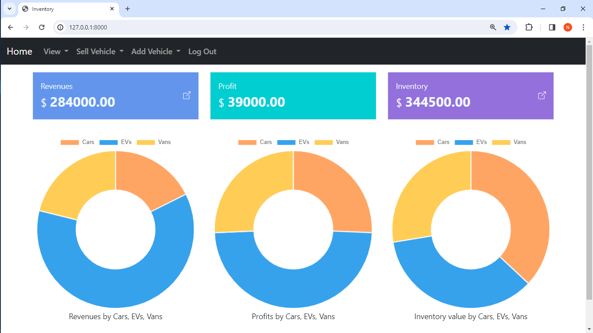
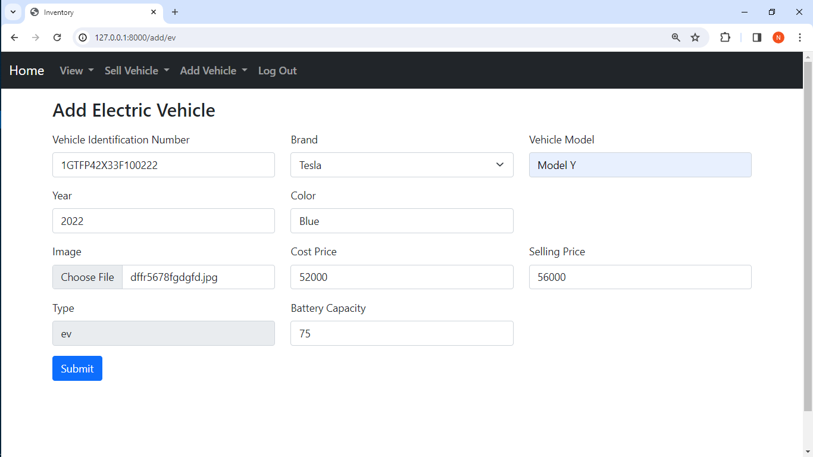
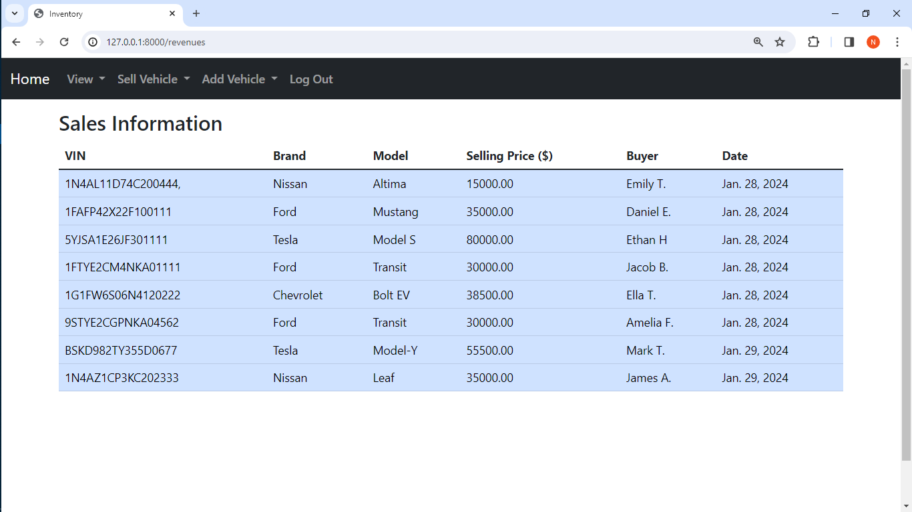
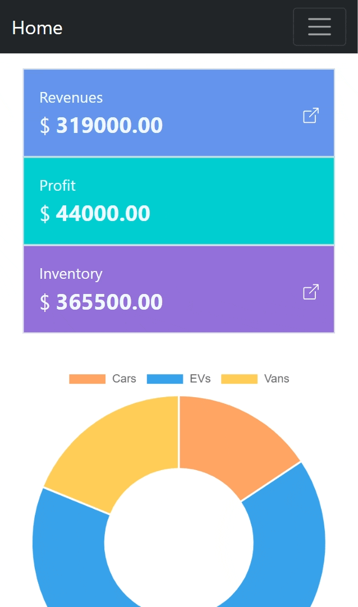

## Capstone project for CS50 Web Programming with Python and Javascript
[Live Demo](https://shop-tvj05rin.b4a.run/)
<br />
[YouTube Video](https://www.youtube.com/watch?v=vqMDKPVb3Bc)

## Distinctiveness and Complexity:

This application aims to address the specific needs of businesses selling Vehicles. Essentially, this application allows users to keep track of vehicles added and sold. All behicles are catogorized into three types(Cars, EVs and Vehicles). When a user not logged in, they can view the information of all non-sold and sold vehicles in tabular form. When user logged in, additionally they can add new vehicles and sell existing vehicles. This applicaiton consists of a simple dashboard in homepage, and its charts are processed according to sold vehicles and non-sold vehicles. 

<br />
This is the first page user interacts first. If user is not logged in, they can't see "Sell vehicle" and "Add Vehicle" in the navbar. So only logged-in users can add or sell vehicles.
In dashboard, "Revenues" represent the total selling prices of sold vehicles, "Profit" represent the sum of difference of selling price and cost price of all sold vehicles, "Inventory" represent the sum of selling prices of non sold vehicles.
At the bottom there are 3 charts this representing Revenues, Profit and Inventory values by each vehicle type(Cars, EVs, Vans).
Here I have used chartJS library to build charts. Which wasn't used in previous projects. When the home page is reloading always data is fetched from database to update the dashboard.
<figure>
    
</figure>

<br />
This is the page where user can add an EV(Electrice vehicle). Here, user need to enter details of the vehicle and can upload an image if available.
The attributes like VIN(Vehicle Identificatin Number), Brand, Model... are common to all vehicle types(Car, EV, Van). But fuel type, fuel capacity, battery capacity isn't. 
So if user adding a Car or a Van, "battery capacity" field as shown below is not shown, instead "Fuel Type" and "Fuel Capacity" is shown.
When adding an image for a vehicle they are saved on a seperate folder in root directory known 'media'. This feature wasn't used in previous projects.
<figure>
    
</figure>

<br />
This is where user can view all non sold vehicles in tabular form. User can view the image of vehicle by clicking the icon at end of the row. Which the image is fetched from a seperate folder known 'media'.
<figure>
    
</figure>

<br />
This is where user can view all sold vehicle information such as VIN, selling price, buyer and Sold date in tabular form.
<figure>
    
</figure>
<hr />
This project is very different  from previous projects due to following reasons.

  1. When adding a vehicle to inventory, users have the option to submit a vehicle image if applicable. These images are saved in a dedicated folder('media') at the root directory of the project. This feature was not applied in previous projects.
  2. The project utilizes @require_http_methods decorater provided by django to reduce boilerplate code for few functions in views.py.
  3. The project utilizes chart.js library to display revenues, profits and inventory values by vehicle type as charts
  4. The application is completely mobile responsive.
<figure>
    
</figure>

## Default Credentials for loggin

- **Username:** admin
- **Password:** admin

## Project Structure:

<pre>

shop/
├─ inventory/
│  ├─ migrations/
│  │  ├─ __init__.py
│  ├─ __init__.py
│  ├─ admin.py
│  ├─ apps.py
│  ├─ models.py
│  ├─ tests.py
│  ├─ views.py
|  ├─ static/
|  │ ├─ inventory/
|  |   ├─ utils.js
|  |   ├─ index.js
|  ├─ templates/
|  │ ├─ add_page.html
|  │ ├─ index.html
|  │ ├─ layout.html
|  │ ├─ login.html
|  │ ├─ revenues.html
|  │ ├─ sell_page.html
|  │ ├─ vehicles.html
├─ shop/
│  ├─ __init__.py
│  ├─ asgi.py
│  ├─ settings.py
│  ├─ urls.py
│  ├─ wsgi.py
├─ media/
</pre>


### What’s contained in each file:

## requirements.txt
- This file included the required python libraries required to run this projet

## readme.md
- This is the file right now you are interacting with.

## models.py

- Here includes all 6 models of this project

  
### Vehicle

#### Vehicle Class Attributes
  - **brand**: The brand of the vehicle (max length: 16 characters).
  - **model**: The model of the vehicle (max length: 32 characters).
  - **year**: The manufacturing year of the vehicle.
  - **color**: The color of the vehicle (max length: 16 characters).
  - **vin**: Vehicle Identification Number (unique, max length: 30 characters).
  - **image**: Image field for vehicle photos.
  - **cost_price**: Cost price of the vehicle (max digits: 10, decimal places: 2).
  - **selling_price**: Selling price of the vehicle (max digits: 10, decimal places: 2).
  - **sold**: Boolean field indicating whether the vehicle is sold (default: False).
  - **type**: Type of the vehicle (max length: 3, nullable and blank).
    
#### Vehicle Class Methods

- **__str__(self)**: Returns a formatted string representation of the vehicle.

- **get_sum_inventory_value()**: Calculates and returns the sum of selling prices for non-sold vehicles in the inventory.

- **get_sum_cost_prices()**: Calculates and returns the sum of cost prices for sold vehicles.

- **get_sum_selling_prices()**: Calculates and returns the sum of selling prices for sold vehicles.

- **get_profit()**: Computes and returns the profit or difference between the sum of selling prices and the sum of cost prices for sold vehicles.

  
### Car
inherit from the Vehicle class

#### Car Class Attributes
 - **fuel_type**: The type of fuel the car uses (max length: 16 characters).
 - **fuel_capacity_liters**: Fuel capacity of the car in liters (max digits: 6, decimal places: 2).

### ElectricVehicle
inherit from the Vehicle class

#### ElectricVehicle Class Attributes
- **battery_capacity_kwh**: Battery capacity of the electric vehicle in kilowatt-hours (max digits: 8, decimal places: 2).
  
### Van
inherit from the Vehicle class

#### Van Class Attributes
 - **fuel_type**: The type of fuel the car uses (max length: 16 characters).
 - **fuel_capacity_liters**: Fuel capacity of the car in liters (max digits: 6, decimal places: 2).

### Sale
sale information
#### Sale Class Attributes
 - **vehicle**: ForeignKey linking to the `Vehicle` model, establishing a relationship.
 - **buyer_name**: The name of the buyer (max length: 32 characters).
 - **sale_date**: The date of the sale (auto-generated at the time of creation).

## urls.py


- ** ""(empty path)**: Maps to the index view. This is likely the home page.
- **login"**: Maps to the login_view view.
- **logout"**: Maps to the logout_view view.
- **revenues"**: Maps to the revenues view.
- **vehicles"**: Maps to the vehicles view.
- **sell/str:vtype"**: Maps to the sell_view view, where <str:vtype> is a variable capturing the vehicle type.
- **add/str:vtype"**: Maps to the add_view view, where <str:vtype> is a variable capturing the vehicle type.

### API Routes
- **api/sell"**: Maps to the sell view in the API.
- **api/add"**: Maps to the add view in the API.
- **api/chartdata/str:chart"**: Maps to the data_charts view in the API, where <str:chart> is a variable capturing the chart type.

## views.py

- **index**: Renders the main dashboard with calculated profit, revenues, and inventory.

- **login_view**: Handles user login attempts, authenticating and redirecting if successful.

- **logout_view**: Logs out the user and redirects to the main dashboard.

- **revenues**: Renders a page displaying all recorded sales transactions.

- **vehicles**: Renders a page with all unsold vehicles.

- **data_charts**: Provides API endpoints to fetch data for revenue, profit, and unsold inventory charts.

- **sell**: Handles the selling of a vehicle, updating sales records and marking the vehicle as sold.

- **add**: Handles the addition of a new vehicle, considering different types (car, ev, van).

- **sell_view**: Renders a page for selling vehicles of a specific type.

- **add_view**: Renders a page for adding vehicles of a specific type.

## static/inventory

### index.js
executes loadCharts function in utils.js file
  
### utils.js
  
  - **loadCharts**: Asynchronously loads revenue, profit, and inventory charts.

  - **fetchData**: Asynchronously fetches data from the specified API endpoint, parsing and returning the received data.

  - **vehicle_revenue_chart**: Asynchronously creates a doughnut chart for revenue distribution using data fetched from the 'revenues' endpoint.

  - **vehicle_profit_chart**: Asynchronously creates a doughnut chart for profit distribution using data fetched from the 'profits' endpoint.

  - **vehicle_inventory_chart**: Asynchronously creates a doughnut chart for unsold inventory distribution using data fetched from the 'unsold' endpoint.

## templates/inventory

### layout.html
 Serves as a central template providing a consistent  layout for all pages in the application.

### login.html
 Facilitates user authentication by providing a login interface.
 
 
### add_page.html
Provides a user interface for adding new vehicles to the Inventory.

 
### sell_page.html
  Enables users to sell vehicles by providing an interface where they can enter the buyer's name and select the vehicle for sale.

### index.html
 Serves as the dashboard for the application, presenting revenues, profit, inventory status, charts at a glance.
  
### revenues.html
 Presents sale data information in a tabular format.
  
### vehicles.html
Displays a tabular format listing of all non-sold vehicles in the application. Users can  view vehicle images by clicking on an icon located at the end of each table row.

## How to run
Go to the root directory of the project which contains "manage.py" file
```cmd
pip install -r requirements.txt
python manage.py runserver
```
Open  http://127.0.0.1:8000/ on your web browser

